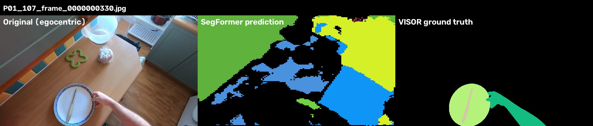
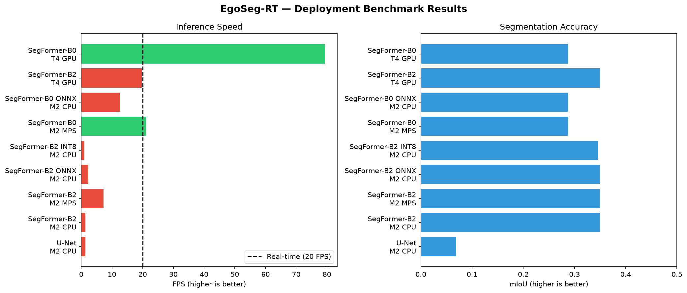

# EgoSeg-RT 🎥

> **Real-Time Egocentric Semantic Segmentation — Systematic Deployment Characterization**

[](https://python.org)
[](https://pytorch.org)
[](LICENSE)
[]()

---

## What is EgoSeg-RT?

EgoSeg-RT is a systematic study of real-time semantic segmentation deployment on **egocentric (first-person) video** from wearable cameras. We characterize the accuracy, speed, and efficiency trade-offs of transformer-based segmentation models across hardware platforms and export formats — and quantify the domain gap between standard indoor benchmarks and real egocentric footage.

---

## The Problem

Semantic segmentation models achieve strong results on standard benchmarks like ADE20K, but their behaviour when deployed on **wearable egocentric cameras** is poorly understood:

- How fast do they run on edge hardware?
- How much accuracy is lost moving to egocentric video?
- Which model variant gives the best speed/accuracy trade-off for deployment?
- Does quantization help or hurt?

No systematic study exists that answers all of these questions together with a reproducible deployment pipeline.

---

## Research Questions

```
1. Which SegFormer variant (B0 vs B2) and export format
   (PyTorch vs ONNX FP32 vs INT8) is best for
   real-time wearable deployment?

2. How severely does domain shift degrade performance
   when moving from ADE20K to egocentric kitchen footage?

3. Can domain adaptation (fine-tuning on VISOR-HOS)
   recover the lost accuracy?
```

---

## Key Findings

| Finding | Result |
|---------|--------|
| Only B0 on GPU/MPS achieves real-time (>20 FPS) | B0 T4 GPU: **79.4 FPS**, B0 M2 MPS: **21.1 FPS** |
| Hardware matters more than export format | B2 CPU→MPS: 7× speedup vs ONNX: 1.7× speedup |
| Domain shift is catastrophic | ADE20K mIoU 0.350 → VISOR IoU ≈ 0.000 |
| Model confuses egocentric kitchen with outdoors | Sink predicted as "building", hob as "grass" |
| B0 offers best deployment trade-off | 18% mIoU drop, 4× faster than B2 on GPU |

---

## Complete Benchmark Table

| Model | Export | Hardware | FPS | Latency | mIoU (ADE20K) | Size |
|-------|--------|----------|-----|---------|----------------|------|
| U-Net | PyTorch | M2 CPU | 1.3 | 769ms | 0.069 | 90MB |
| SegFormer-B2 | PyTorch | M2 CPU | 1.3 | 769ms | 0.350 | 105MB |
| SegFormer-B2 | PyTorch | M2 MPS | 7.3 | 137ms | 0.350 | 105MB |
| SegFormer-B2 | ONNX FP32 | M2 CPU | 2.2 | 450ms | 0.350 | 105MB |
| SegFormer-B2 | INT8 | M2 CPU | 1.0 | 1000ms | 0.346 | 29MB |
| SegFormer-B0 | PyTorch | M2 MPS | **21.1** | 47ms | 0.287 | 15MB |
| SegFormer-B0 | ONNX FP32 | M2 CPU | 12.6 | 79ms | 0.287 | 15MB |
| SegFormer-B2 | PyTorch | T4 GPU | 19.7 | 50ms | 0.350 | 105MB |
| SegFormer-B0 | PyTorch | T4 GPU | **79.4** | 12ms | 0.287 | 15MB |

> Real-time threshold: 20 FPS. ✅ = above real-time, ❌ = below.

---

## Distribution Shift Analysis

We evaluate ADE20K-trained SegFormer-B2 on **VISOR-HOS** — a benchmark of egocentric kitchen footage with 272K manually annotated masks.

```
ADE20K (in-domain):     mIoU = 0.350
VISOR-HOS (egocentric): IoU  ≈ 0.000  ← catastrophic degradation
```

### Why does it fail?

| Failure Mode | Example |
|---|---|
| Viewpoint shift | Top-down kitchen view → predicted as outdoor ground |
| Scale shift | Close-up sink fills frame → predicted as building exterior |
| Content shift | Kitchen tools not present in ADE20K training data |
| Hand blindness | Hands occupy 30% of egocentric frames, IoU = 0.000 |

---

## Architecture

```
POV Camera (iPhone / wearable)
        ↓
Frame Extraction (1 FPS for evaluation)
        ↓
Preprocessing: resize 512×512 + ImageNet normalization
        ↓
SegFormer Inference (B0 or B2)
    PyTorch / ONNX FP32 / ONNX INT8
        ↓
Argmax → pixel class map (150 ADE20K classes)
        ↓
Colour-coded segmentation mask
        ↓
Demo video with PiP layout + numerical overlays
```

---

## Demo

### Segmentation on Egocentric Footage


*Original egocentric frame | SegFormer-B2 prediction | VISOR ground truth.
The model trained on ADE20K misclassifies kitchen scenes as outdoor environments.*

### Benchmark Results


*Green bars = real-time (>20 FPS). Only B0 on MPS/GPU crosses the threshold.*ß

## Datasets

| Dataset | Purpose | Size | Source |
|---------|---------|------|--------|
| ADE20K | Training + in-domain evaluation | 20,210 images, 150 classes | MIT |
| VISOR-HOS | Egocentric domain shift evaluation | 272K masks, 257 classes | Bristol/EPIC-KITCHENS |
| POV footage | Real wearable camera evaluation | 112 frames, 1:47 min | Recorded (iPhone, chest-height) |

---

## Repository Structure

```
egoseg_rt/
├── scripts/
│   ├── 01_extract_frames.py          ← extract frames from POV video
│   ├── 02_run_segformer.py           ← SegFormer-B2 PyTorch inference
│   ├── 03_create_demo_video.py       ← PiP demo video with overlays
│   ├── 04_benchmark_onnx.py          ← ONNX FP32 benchmark
│   ├── 05_benchmark_b0.py            ← SegFormer-B0 PyTorch benchmark
│   ├── 06_benchmark_b0_onnx.py       ← SegFormer-B0 ONNX benchmark
│   ├── 07_gpu_benchmark_kaggle.py    ← T4 GPU benchmark (Kaggle)
│   ├── 08_results_table.py           ← generate benchmark table + plot
│   ├── 09_generate_gt_masks.py       ← rasterize VISOR polygons → masks
│   ├── 10_visor_miou.py              ← distribution shift measurement
│   └── 11_qualitative_analysis.py    ← qualitative comparison figures
│
├── results/
│   ├── benchmark_table.csv           ← complete benchmark results
│   └── benchmark_plot.png            ← FPS vs mIoU visualization
│
├── models/
│   ├── segformer_b0_epoch10.pt       ← trained B0 checkpoint
│   └── segformer_b0.onnx             ← exported B0 ONNX model
│
└── outputs/
    └── demo_video.mp4                ← segmentation demo video
```

---

## Quick Start

### 1 — Setup environment

```bash
conda activate deeplearn
pip install torch torchvision transformers opencv-python onnxruntime
```

### 2 — Extract frames from your POV video

```bash
python scripts/01_extract_frames.py
# Edit video_path in script to point to your .MOV file
# Output: data/frames/ — one JPEG per second
```

### 3 — Run SegFormer inference

```bash
python scripts/02_run_segformer.py
# Output: data/masks/ — colour-coded segmentation masks
# Prints: avg latency and FPS on your hardware
```

### 4 — Create demo video

```bash
python scripts/03_create_demo_video.py
# Output: outputs/demo_video.mp4
# PiP layout with numerical overlays
```

### 5 — Run full benchmark

```bash
python scripts/08_results_table.py
# Output: results/benchmark_table.csv + benchmark_plot.png
```

---

## Models

All models trained on ADE20K (150 classes, 512×512 input):

| Model | Checkpoint | mIoU | Download |
|-------|-----------|------|---------|
| SegFormer-B2 | segformer_b2_epoch9.pt | 0.350 | Kaggle |
| SegFormer-B0 | segformer_b0_epoch10.pt | 0.287 | Kaggle |
| SegFormer-B2 ONNX | segformer_b2.onnx | 0.350 | Kaggle |
| SegFormer-B0 ONNX | segformer_b0.onnx | 0.287 | Kaggle |

Training notebooks: [Kaggle — samarthramanghanate](https://www.kaggle.com/samarthramanghanate)

---

## Hardware

All Mac benchmarks run on **Apple M2 Pro** (16GB unified memory) using MPS acceleration via PyTorch. GPU benchmarks run on **NVIDIA Tesla T4** (15.6GB VRAM) via Kaggle.

---

## Related Work

| Paper | Relevance |
|-------|-----------|
| SegFormer (Xie et al., NeurIPS 2021) | Base architecture |
| VISOR (Darkhalil et al., NeurIPS 2022) | Egocentric benchmark |
| ADE20K (Zhou et al., CVPR 2017) | Training dataset |
| EPIC-KITCHENS (Damen et al., IJCV 2022) | Source of VISOR footage |

---

## Citation

If you use this work, please cite:

```bibtex
@misc{ghanate2026egosegrt,
  title   = {EgoSeg-RT: Real-Time Egocentric Semantic Segmentation --
             Systematic Deployment Characterization},
  author  = {Samarth Raman Ghanate},
  year    = {2026},
  note    = {Target: EgoVis Workshop, CVPR 2026}
}
```

---

## Author

**Samarth Raman Ghanate**
M.Sc. Electromobility Engineering — FAU Erlangen-Nürnberg
Research Assistant — Siemens Healthineers

[GitHub](https://github.com/Samarthraman01) · [LinkedIn](https://www.linkedin.com/in/samarthghanate/)

---

## Related Projects

- [SemanticBot](https://github.com/Samarthraman01/Semanticbot) — Open-vocabulary semantic 3D mapping with ROS 2
- [MediSeg](https://github.com/Samarthraman01/MediSeg) — Semantic segmentation trained from scratch in PyTorch